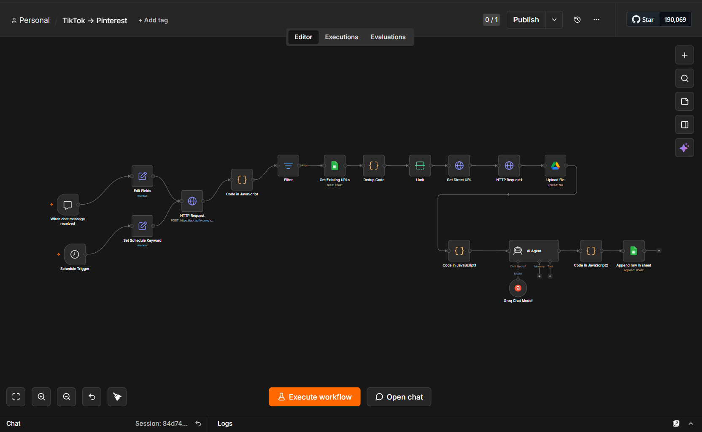
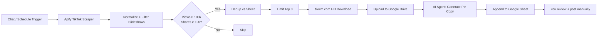

# 🎬 TikTok → Pinterest Automation

[](https://opensource.org/licenses/MIT)
[](https://n8n.io)
[]()
[]()

> Auto-discover viral TikToks → AI-generate Pinterest pin copy → queue in Google Sheets for review. Built with n8n. **Free tier only — $0/month.**

A single n8n workflow that scrapes TikTok by keyword, filters for viral content, downloads watermark-free HD videos, uploads them to Google Drive, generates SEO-optimized Pinterest titles + descriptions with AI, and writes everything to a Google Sheet for manual review.

---

## ✨ What it does


- 🔍 **Keyword-driven discovery** — type `slow living` or `anime amv` and the workflow finds top-performing TikToks
- 📥 **Watermark-free HD downloads** — uses tikwm.com to fetch the original-quality video without TikTok logos
- 🎨 **Photo slideshow filter** — automatically rejects TikTok carousels (image-only posts) so you only get real video
- 🤖 **AI-generated pin copy** — Pinterest-optimized titles + descriptions with SEO hashtags
- 📊 **Google Sheets review queue** — manual approval before posting (Pinterest API integration optional)
- 🌐 **Two entry points** — run on a schedule OR trigger manually via chat with a custom keyword

---

## 🛠️ Tech stack

| Tool | Purpose | Cost |
|------|---------|------|
| [n8n](https://n8n.io) | Workflow orchestrator | Free (self-host or Cloud trial) |
| [Apify](https://apify.com) | TikTok scraper | Free credits (~$5/mo) |
| [tikwm.com](https://www.tikwm.com) | HD video download | Free, no key |
| [Google Drive](https://drive.google.com) | Video storage | Free 15 GB |
| [Google Sheets](https://sheets.google.com) | Review queue | Free |
| [Groq](https://console.groq.com) | AI title/description (recommended) | Free tier (generous) |
| [OpenRouter](https://openrouter.ai) | AI fallback | Free models available |

---

## 🚀 Quick start
1. Clone this repo
git clone https://github.com/mehdreaming/tiktok-to-pinterest.git
2. Install n8n (Docker)
docker run -it --rm --name n8n -p 5678:5678 -v ~/.n8n:/home/node/.n8n docker.n8n.io/n8nio/n8n
3. Open http://localhost:5678 → import "TikTok → Pinterest.json"
4. Add credentials (see API setup below)
5. Hit "Execute Workflow" → type a keyword in chat → check your Google Sheet

---

## 📋 Prerequisites

You need accounts on 5 services (all free):

1. **n8n** — [n8n Cloud](https://n8n.io) (14-day trial) or self-host via Docker
2. **Apify** — for TikTok scraping
3. **Google Cloud project** — for Drive + Sheets OAuth
4. **Groq** — for AI text generation (recommended)
5. **OpenRouter** — alternative AI provider (optional)

---

## 🔑 How to get each API key

### 1️⃣ Apify (TikTok Scraper)

<details>
<summary><b>Click to expand step-by-step</b></summary>

1. Go to [apify.com](https://apify.com) → **Sign up** (free)
2. Once logged in, click your profile (top right) → **Settings**
3. Click **Integrations** in the sidebar
4. Under **Personal API tokens**, click **Create new token**
5. Name it `n8n` → click **Create**
6. **Copy the token** — it looks like `apify_api_xxxxxxxxxxxxxxxxxxxxxxxxxxxxxxxx`
7. ⚠️ **Save it now** — you can't view it again

**Also set up the TikTok scraper actor:**
1. Go to [apify.com/clockworks/tiktok-scraper](https://apify.com/clockworks/tiktok-scraper)
2. Click **Try for free** to add it to your account
3. Free tier gives you ~$5/month in credits = ~500 free scrapes

</details>

### 2️⃣ Google Cloud (Drive + Sheets OAuth)

<details>
<summary><b>Click to expand step-by-step</b></summary>

#### Create a Google Cloud project
1. Go to [console.cloud.google.com](https://console.cloud.google.com)
2. Click **Select a project** (top bar) → **New Project**
3. Name it `tiktok-pinterest-n8n` → **Create**

#### Enable the APIs
1. With the project selected, go to **APIs & Services → Library**
2. Search and enable each of these:
   - **Google Drive API** → click → **Enable**
   - **Google Sheets API** → click → **Enable**

#### Configure OAuth consent screen
1. Go to **APIs & Services → OAuth consent screen**
2. Select **External** → **Create**
3. Fill in:
   - App name: `n8n-tiktok-pinterest`
   - User support email: your email
   - Developer contact: your email
4. **Save and Continue** through Scopes, Test Users, Summary
5. Add **your own Google email** as a Test User
6. **Back to Dashboard**

#### Create OAuth credentials
1. Go to **APIs & Services → Credentials**
2. Click **+ Create Credentials → OAuth client ID**
3. Application type: **Web application**
4. Name: `n8n-oauth`
5. **Authorized redirect URIs**: add this exact URL (for n8n Cloud):
https://YOUR-N8N-SUBDOMAIN.app.n8n.cloud/rest/oauth2-credential/callback
   (For self-hosted: `http://localhost:5678/rest/oauth2-credential/callback`)
6. **Create** → copy the **Client ID** and **Client Secret**

#### Create your Google Sheet
1. Go to [sheets.google.com](https://sheets.google.com) → create a new sheet
2. Name it `Pinterest Queue`
3. Add these column headers in Row 1:
timestamp | keyword | tiktok_url | views | shares | duration | drive_file_id | drive_url | pin_title | pin_description | status
5. **Copy the Sheet ID** from the URL: `docs.google.com/spreadsheets/d/SHEET_ID_HERE/edit`

#### Create your Google Drive folder
1. Go to [drive.google.com](https://drive.google.com) → **New → Folder**
2. Name it `TikTok Pins`
3. Open the folder → **Copy the Folder ID** from the URL: `drive.google.com/drive/folders/FOLDER_ID_HERE`

</details>

### 3️⃣ Groq (AI text generation — recommended)

<details>
<summary><b>Click to expand step-by-step</b></summary>

Groq has the most generous free tier — way more requests/day than OpenRouter's free tier.

1. Go to [console.groq.com](https://console.groq.com) → **Sign up** (Google login works)
2. Once in, click **API Keys** in the left sidebar
3. Click **Create API Key**
4. Name it `n8n` → **Submit**
5. **Copy the key** — looks like `gsk_xxxxxxxxxxxxxxxxxxxxxxxxxx`
6. ⚠️ **Save it now** — you can't view it again

**Recommended model**: `llama-3.3-70b-versatile` (best quality, free tier handles ~14,400 requests/day).

</details>

### 4️⃣ OpenRouter (alternative AI provider)

<details>
<summary><b>Click to expand step-by-step</b></summary>

Use this if Groq runs out or you want DeepSeek instead of Llama.

1. Go to [openrouter.ai](https://openrouter.ai) → **Sign in** with Google
2. Click your profile (top right) → **Keys**
3. Click **+ Create Key**
4. Name it `n8n` → **Create**
5. **Copy the key** — looks like `sk-or-v1-xxxxxxxxxxxxxxxxx`

**Free models available:**
- `deepseek/deepseek-chat-v3.1:free`
- `meta-llama/llama-3.1-8b-instruct:free`
- `google/gemini-2.0-flash-exp:free`

</details>

---

## ⚙️ n8n setup

### Step 1: Install n8n

**Option A — Docker (recommended for self-host):**
docker run -it --rm \
--name n8n \
-p 5678:5678 \
-v ~/.n8n:/home/node/.n8n \
docker.n8n.io/n8nio/n8n
Open `http://localhost:5678`.

**Option B — n8n Cloud:**
1. Go to [n8n.io](https://n8n.io) → start free trial
2. Note your subdomain: `https://YOUR-SUBDOMAIN.app.n8n.cloud`

### Step 2: Import the workflow

1. In n8n, click **Workflows** (left sidebar)
2. Click **Add workflow → Import from file**
3. Select `TikTok → Pinterest.json` from this repo
4. Click **Import**

### Step 3: Add credentials in n8n

Go to **Credentials → New** and create each one:

#### A. Apify (HTTP Header Auth)
- Credential type: **HTTP Header Auth**
- Name: `Apify`
- Header Name: `Authorization`
- Header Value: `Bearer YOUR_APIFY_TOKEN`

#### B. Google Drive (OAuth2)
- Credential type: **Google Drive OAuth2 API**
- Client ID: paste from Google Cloud
- Client Secret: paste from Google Cloud
- Click **Sign in with Google** → authorize your test user account

#### C. Google Sheets (OAuth2)
- Credential type: **Google Sheets OAuth2 API**
- Use the same Client ID + Secret as above
- Click **Sign in with Google** → authorize

#### D. Groq (AI)
- Credential type: **Groq API**
- API Key: paste your Groq key

#### E. OpenRouter (AI, optional)
- Credential type: **OpenAI API** (compatible)
- API Key: paste your OpenRouter key
- Base URL: `https://openrouter.ai/api/v1`

### Step 4: Wire credentials into the workflow

Open the imported workflow and update these nodes:

| Node | What to set |
|------|-------------|
| **Apify HTTP node** | Credential: `Apify` |
| **Get Existing URLs** (Sheets) | Credential: Google Sheets · Document: paste your **Sheet ID** |
| **Drive Upload** | Credential: Google Drive · Parent Folder: paste your **Folder ID** |
| **AI Agent → Chat Model** | Credential: Groq · Model: `llama-3.3-70b-versatile` |
| **Append row in sheet** | Credential: Google Sheets · Document: paste your **Sheet ID** |

### Step 5: Test it

1. Click **Open Chat** (or **Execute Workflow** with the chat trigger)
2. Type a keyword: `slow living routine` or `anime amv`
3. Wait ~30-60 seconds
4. Check your Google Sheet — you should see 3 new rows with AI-generated copy 🎬

---

## 🎛️ Configuration

Customize these values in the workflow nodes:

### Filter thresholds (Filter node)
$json.views      >= 100000   // minimum views
$json.shares     >= 100      // minimum shares
$json.duration   between 7 and 60   // seconds
Tweak these per niche. Anime content typically has lower share counts than lifestyle.

### Scheduled keyword rotation (Set Schedule Keyword node)
= ['anime amv','studio ghibli','anime aesthetic','anime edit','manga panel','anime scenery','anime soundtrack'][$now.weekday - 1] 
Map any 7 keywords to days of the week for automated daily runs.

### AI tone (AI Agent system prompt)
Customize the system message to match your brand voice:
- Lifestyle: warm, slow, intentional
- Anime: cinematic, poetic, film-critic
- Recipes: hook-driven, hashtag-heavy

---

## 🔥 Common errors & fixes

<details>
<summary><b>TikTok CDN 403 Forbidden</b></summary>

Add these headers to the **HTTP Request1** node:
Referer: https://www.tiktok.com/
User-Agent: Mozilla/5.0 (Macintosh; Intel Mac OS X 10_15_7) AppleWebKit/537.36 (KHTML, like Gecko) Chrome/124.0.0.0 Safari/537.36
</details>

<details>
<summary><b>Workflow returns audio-only (no video)</b></summary>

The keyword is matching TikTok photo slideshows. The Normalize node has a built-in filter that skips slideshows — make sure you're using the latest version of the Code node. Use video-heavy keywords like `anime amv`, `studio ghibli`, `cozy routine`. Avoid `manga panel`, `anime quote` (mostly slideshows).
</details>

<details>
<summary><b>AI returns markdown-wrapped JSON</b></summary>

The "Clean JSON" code node strips ` ```json ` fences automatically. Also add *"respond with pure JSON only — no markdown, no code fences"* to the system prompt.
</details>

<details>
<summary><b>OpenRouter "Data limit reached"</b></summary>

Free models have daily token caps. Switch to Groq (much higher free tier) or rotate between providers. Recommended: `llama-3.3-70b-versatile` on Groq.
</details>

<details>
<summary><b>Drive upload "File not found"</b></summary>

The HTTP Request1 node must have **Response Format = File** and **Binary Property Name = data**. Both must match the Drive Upload's input field name.
</details>

<details>
<summary><b>Google OAuth "redirect_uri_mismatch"</b></summary>

The redirect URI in Google Cloud Console must EXACTLY match n8n's callback URL. For n8n Cloud: `https://YOUR-SUBDOMAIN.app.n8n.cloud/rest/oauth2-credential/callback`. No trailing slash.
</details>

---

## 🗺️ Roadmap

- [ ] Pinterest API integration (auto-post approved rows)
- [ ] yt-dlp fallback for blocked downloads
- [ ] AI cover thumbnail generation (better Pinterest CTR)
- [ ] Telegram/Slack error alerts
- [ ] Local Ollama integration ($0 AI cost)
- [ ] Semantic deduplication (similar-video detection)

---

## 📂 Repo structure
.
├── TikTok → Pinterest.json   # Importable n8n workflow
├── workflow.png               # Architecture screenshot
├── LICENSE                    # MIT
├── README.md                  # This file
└── .gitignore

---

## 🤝 Contributing

PRs welcome! Particularly interested in:
- New niche-specific AI prompts
- Cover image generation nodes
- Pinterest API auto-post implementation
- yt-dlp Docker integration

Open an issue first if you're building anything substantial — let's chat about it.

---

## 📜 License

MIT — do whatever you want with this. Attribution appreciated but not required.

---

## 🌐 Connect

Built by **[@mehdreaming](https://github.com/mehdreaming)** 

- 📌 Pinterest: [framearchivedaily](https://pinterest.com/framearchivedaily) — daily anime frames
- 📷 Instagram: [@mehdreaming](https://instagram.com/mehdreaming) — AMV edits
- 💼 Open to collabs on automation + creator tools

If this saved you time, **drop a ⭐ on the repo** — it really helps.

---

<sub>Built with [n8n](https://n8n.io), [Apify](https://apify.com), [Groq](https://groq.com), and a lot of coffee ☕</sub>
